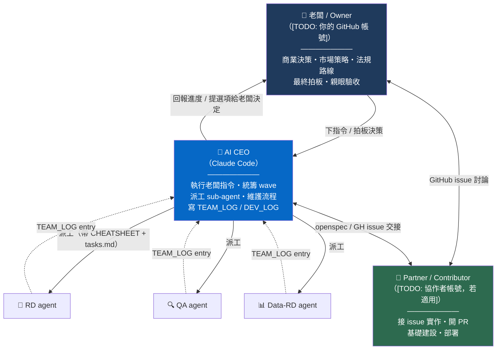
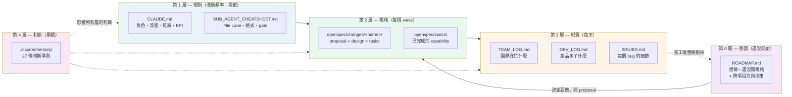
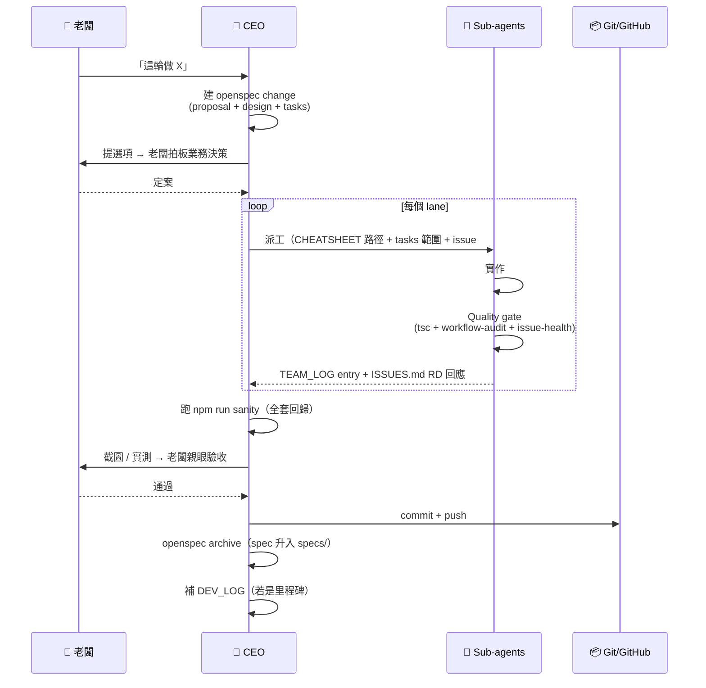
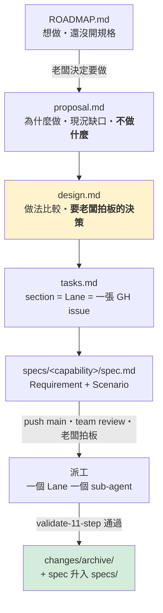
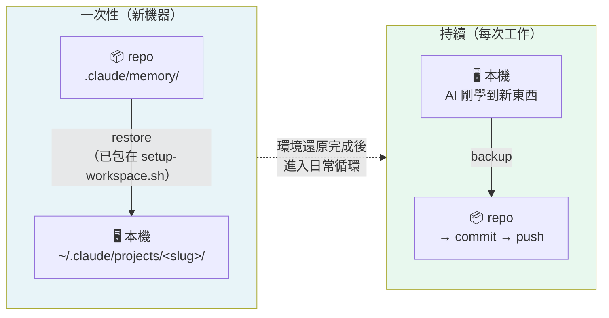

# AI-CEO 協作模式 — 運作手冊與可複製範本

> 這份文件說明怎麼用「一位老闆 + 一位 AI CEO + 一位人類 partner」的組合運作一個專案。
> 它同時是**現況說明書**（給 partner / 未來加入的人）跟**可套用範本**（給下一個專案）。
>
> 這份範本抽取自一個實戰累積 15+ merged PR、1100+ issue、90+ wave 的真實專案（TripTrust）。
> 文中具體數字與案例（例如「react-leaflet 的 eventHandlers」「27 條 memory」）是那個專案的
> 真實情況，留著當**案例參考**；套用到你的專案時，數字會從零開始重新累積，機制不變。

---

## 1. 這套模式在解什麼問題

一人（或兩人）團隊用 AI 開發時，最常見的失敗不是「AI 寫不出 code」，而是這三件事：

| 失敗模式 | 症狀 | 這套模式怎麼擋 |
|---|---|---|
| **記憶歸零** | 每開新對話，AI 忘記上次踩的坑，同一個錯犯三次 | `.claude/memory/` 27 條累積判斷，跨機器可還原 |
| **流程漂移** | 這次用 A 流程、下次用 B，交接時沒人知道規矩 | `CLAUDE.md` + `SUB_AGENT_CHEATSHEET.md` 進版控，是唯一真相 |
| **自稱完成** | AI 回報「修好了」，老闆一開就是壞的 | Quality gate 自動化 + 「reporter 才能 verify」硬規則 |

核心信念：**流程寫進 repo、判斷寫進 memory、驗證交給機器**。人只做機器不能做的決定。

---

## 2. 角色分工



### 界線在哪

| 只有老闆能做 | 只有 CEO 做 | Sub-agent 不能做 |
|---|---|---|
| 商業 / 法規 / 市場決策 | `git commit` / `push` | 任何 git 寫入操作 |
| 金額、定價、條款 | 派工 + 決定 wave 範圍 | `npm run build`（慢且耗 quota）|
| 最終視覺驗收 | 寫 DEV_LOG | `DROP` / `DELETE` / `TRUNCATE` |
| 「要不要做」 | 跑 quality gate 驗收 | 跨 File Lane 寫檔 |

**一條血淚規則**：CEO 不准代老闆做決定。任何寫成「老闆已定 X」的措辭都必須來自明確確認，否則要寫「CEO 建議 X，待老闆確認」。（來源：`.claude/memory/feedback_dont_decide_for_owner.md`）

---

## 3. 五層文件體系

不同顆粒度的資訊分開放，同一件事不重複寫三次。



**第 0 層是 2026-09-11 才補上的。** 在那之前，「想做但還沒開規格」的東西沒有地方放，
只好記在第 4 層的 memory 裡當提醒 —— 而 memory 只有 AI 看得到。後果見 §6 的第 ⑧ 條。

### 三份 log 各回答什麼問題

| 檔案 | 回答 | 顆粒度 | 誰寫 |
|---|---|---|---|
| **TEAM_LOG.md** | 「團隊這週在忙什麼？卡在哪？」 | 每 wave 一條 | 每個 agent 收工自己 prepend |
| **DEV_LOG.md** | 「產品從上版到現在多了什麼？」 | 每里程碑一條 | CEO 在 push / release 前補 |
| **ISSUES.md** | 「#1054 改了哪個檔哪一行？怎麼驗？」 | 每 issue 一條 | RD 寫 `**RD 回應：**` ≥80 字 |

[TODO: 若你的產品有內部團隊儀表板頁面讀取 TEAM_LOG.md，在這裡註明頁面路徑與讀取邏輯所在檔案。]

---

## 4. Wave 生命週期

一個 wave = 一批有主題的工作，從規格到歸檔的完整循環。



### 驗收 gate（每個 wave 收尾必跑）

```bash
# [TODO: 若程式碼在 app/ 子目錄，先 cd app]
npx tsc --noEmit                      # 0 errors
npm run sanity                        # 回歸測試（範本未含，選配——寫法見上方 sanity README 說明）
node scripts/workflow-audit.mjs       # issue FSM 一致性（範本未含，需自行寫）
node scripts/issue-health-check.mjs   # issue # 不撞、欄位完整（範本未含，需自行寫）
node scripts/ceo/validate-11-step.mjs # CEO 驗收腳本（範本未含，依你的產品客製）
```

**硬規則**：agent 自報 PASS 不算數，CEO 必須親自 replay；CEO 說 PASS 也不算數，UI 改動老闆必須親眼看。

每個 sanity 測項在守什麼契約、什麼時候一定要跑、失敗了該修程式還是改測試：可以仿照 `.qa-tmp/sanity/README.md` 這種模式寫一份（範本未含，是選配的回歸測試骨架，寫法可參考本文件描述的原則）。

---

## 5. openspec —— 規格先行

### 它在解什麼問題

sub-agent 沒有上下文。丟一句「加一個效能守門機制」給它，它會自己猜預算定多少、
要不要擋 commit、既有的歷史債怎麼辦 —— 猜錯了通常要寫完一半才會發現。

openspec 的作用是**把需要人拍板的決策，從實作過程中抽出來，先攤在桌上**。



三份文件各自回答一個問題，**順序不能顛倒**：

| 文件 | 回答的問題 | 寫不好的後果 |
|---|---|---|
| `proposal.md` | 為什麼做？不做會怎樣？**不在範圍內的是什麼**？ | 範圍無限膨脹，agent 漫遊 |
| `design.md` | 有哪些做法？代價各是什麼？**哪幾點要老闆拍板**？ | agent 替老闆做了決定 |
| `tasks.md` | 拆成幾個能平行的 lane？每個 lane 的完工條件？ | 無法平行，或 lane 之間撞檔 |

第三個最常被跳過，但它直接決定組織的吞吐量 —— 一個 section 就是一個 Lane、
一張 GitHub issue、一個 sub-agent。tasks.md 拆得好不好，就是能同時開幾個 agent。

### 決策攤開長什麼樣

`perf-budget-gate` 這個 change 是典型例子。它要做的事一句話講得完
（讓效能預算檢查真的會擋），但裡面有三個沒有標準答案的決策：

| | 決策 | 為什麼不能讓 agent 自己決定 |
|---|---|---|
| ① | 預算數字定多少 | 太鬆等於沒有，太緊會擋住所有人 |
| ② | 6 條路由 5 條不合格，怎麼引入 | 這是「要不要接受歷史債」的政策問題 |
| ③ | 在哪裡跑 | 決定了它有多常被繞過 |

design.md 對每一個都給出選項、取捨、以及 CEO 的建議與理由，
但**標記為待拍板，不寫成已定案**。這是刻意的 —— agent 替老闆做決定，
是這套模式最容易出事的地方。

### 這套機制實際上會怎麼壞

2026-09-11 的盤點抓到三個問題，每一個都是「流程有寫、但沒有人執行」：

| 問題 | 實況 |
|---|---|
| archive 的最後一步沒人做 | openspec 的 archive 會留下 `TBD - created by archiving change X` 佔位符當 Purpose，要人補寫。**27 個 spec，27 個還是佔位符** —— 規格庫只能靠檔名猜內容 |
| 沒有人跑 `openspec validate` | 5 個 active change 有 3 個格式不合格（缺 spec delta），一直沒被發現 |
| 手寫的索引漂掉了 | `CLAUDE.md` 宣稱 15 個 spec（實際 27）、宣稱 active change 是兩個 2026-07-29 就已歸檔的項目 |

第三個是最有代表性的。索引寫在 `CLAUDE.md` 裡是對的（那是唯一會自動載入的文件），
但**它是手寫的**，所以每次有人新增或歸檔 change 都要記得回來改，沒有人會記得。

修法不是「提醒大家要更新」，而是**讓它不需要被更新** ——
`scripts/openspec-inventory.mjs` 掃磁碟產生清單寫進 `openspec/README.md`，
`--check` 在清單過期時 exit 1，`CLAUDE.md` 只留一個指標。

這正是 §7 那條階梯原則的實例：**能寫成腳本就不要寫成文件，能寫成文件就不要靠記憶。**
一份需要人手動維護的索引，本質上和 memory 一樣不可靠。

### 什麼時候該開 change

判準是**「有沒有需要別人拍板的決策」，不是工作量大小**。

- 改一行但會影響 production 資料 → 開 change
- 改五十行但只是照既有 pattern 補齊 → 不用
- bug 直接進 `ISSUES.md`，不走 change；除非追下去發現根因是設計問題

完整的規則、生命週期與當前清單見 [`openspec/README.md`](../openspec/README.md)。

---

## 6. Memory 系統 — 這套模式的靈魂

`CLAUDE.md` 教**流程**，`.claude/memory/` 教**判斷**。後者是這套模式真正難複製的部分。


### 同步機制 — 兩個方向不能搞混

Claude Code 讀 memory 的位置是 `~/.claude/projects/<專案絕對路徑轉的 slug>/memory/`。
slug 跟機器路徑綁定，所以**檔案進 repo ≠ 新機器自動生效**，中間一定要有還原步驟。



| 指令 | 方向 | 何時 | 行為 |
|---|---|---|---|
| `status` | 只比較不動檔 | 隨時 | 列候選（附 description 方便判斷）|
| `backup <檔名>` | 本機 → repo | 老闆點頭後 | **只搬指名的**，不給檔名會擋 |
| `restore` | repo → 本機 | 新機器 clone 後 | **只合併不刪** |

### 策展原則 — repo 收的是精選，不是全部

> **老闆 directive 2026-09-10**：「不是什麼 memory 都需要備份。而是 user 覺得這個是一個
> 重點或重大的經驗才需要 submit」

本機 memory 是**草稿區**，會累積 session 觀察、暫時性進度、未驗證的假設。
repo 的 `.claude/memory/` 是**策展後的精選**。全部塞進去會讓 partner 讀到雜訊、
新機器 restore 後 context 被稀釋、repo 失去「這些都是硬規則」的權威感。

| | 值得 submit ✅ | 留在本機 ❌ |
|---|---|---|
| | 老闆的糾正 | 單次 session 的觀察 |
| | 翻過車的技術坑 | 暫時性進度狀態 |
| | 跨 session 有效的硬規則 | 還沒驗證的假設 |
| | 業務決策定案 | 很快會過期的專案狀態 |

**CEO 的行為約束**：寫完一條 memory 之後要**問老闆這條值不值得 submit**，不要自作主張
跑 `backup --all`。（見 `.claude/memory/feedback_memory_curation.md`）

### 兩個刻意的設計（別改掉）

**① `backup` 不做全量**
策展是老闆的判斷，不是腳本的。`--all` 存在但預設擋住，不給檔名會印出用法並 exit 1。

**② `restore` 不加 `--delete`**
這是修過的 bug。原本兩個方向都用 `rsync --delete`，但如果 repo 只收策展過的精選，
`restore` 的 `--delete` 會**把本機所有還沒 submit 的草稿全部刪掉** —— 等於策展一次
就毀掉工作區。改成純合併。

### 常見誤解：「為什麼 `backup` 不一起放進 `setup-workspace.sh`？」

因為方向相反、時機相反。`setup-workspace.sh` 是一次性還原腳本，clone 完跑一次；
而 clone 當下本機 memory 是空的（正要從 repo 還原），這時跑 `backup`（本機 → repo）
會**拿空目錄覆蓋掉 repo 的所有記憶**。兩者不能合併。

**防 drift**：`pre-commit` hook 每次 commit 比對兩邊，不一致就警告：

```
→ pre-commit: memory drift 偵測
⚠️  本機 memory 跟 repo 不一致：
      feedback_xxx.md project_yyy.md
   要一起 commit 的話先跑：./scripts/sync-memory.sh backup
   （只是提醒，不擋這次 commit）
```

刻意設計成**警告而非自動 staging** —— 一個修 bug 的 commit 突然夾帶 memory 檔
會讓 git history 混亂，由執行 commit 的人當場判斷要不要併進去。

### 27 條的組成（2026-09-11 修剪後）

| 類型 | 數量 | 內容 |
|---|---|---|
| `feedback` | 25 | 老闆的糾正 + 踩過的技術坑 + 判斷準則 |
| `reference` | 2 | 外部工具參考 |

一度長到 46 條，2026-09-11 盤點後刪到 27（−41%）：4 條過期、12 條已被文件或腳本取代、
3 條搬進 [`ROADMAP.md`](../ROADMAP.md)。**修剪是設計的一部分，不是偶爾的整理。**

`project` 型現在是 0 條 —— 專案狀態與待辦一律改放 [`ROADMAP.md`](../ROADMAP.md)，
因為那是人看得到的文件，memory 只有 AI 看得到。

> 📖 **每個設計的理由、要防堵什麼、以及怎麼在新專案復刻一套：
> 見 [`MEMORY_SYSTEM.md`](MEMORY_SYSTEM.md)。**

### 幾條最有代表性的（都是真的翻過車才學到）

| Memory | 學到什麼 |
|---|---|
| `feedback_ceo_must_own_eye_verify` | Wave 79：4 輪 hotfix 互相破壞，agent 每輪都報 PASS，老闆一開就 FAIL。→ CEO 必須自己 replay owner flow，每步 8 秒等待 + 截圖 |
| `feedback_dev_server_restart_must_verify_port` | `pkill` 殺不乾淨，殘留 server 害整頁 CSS 404 裸奔。→ 驗證條件是 `lsof -i :3000` 為空，不是 `pkill` exit 0 |
| `feedback_no_db_write_against_live_server` | 對著跑著的 dev server 寫 DB → SQLite 並發寫壞檔。→ 寫入前先停 :3000 |
| `feedback_react_leaflet_eventhandlers_strict` | react-leaflet 的 `eventHandlers` 遇到非法 event name 會**整包靜默拒收**，marker click 全死。→ 只能寫合法 event |
| `feedback_qa_verify_policy` | QA 檢查「RD 有沒有回應」是假驗證。→ 必須重現原始 repro，確認壞行為不再發生 |
| `feedback_dont_decide_for_owner` | CEO 在給 partner 的信裡寫「老闆已定 X」，但老闆根本沒同意過。→ 未確認一律寫「CEO 建議，待確認」 |
| `feedback_tier_audit_required` | 7 個 QA agent 都沒抓到地圖同時顯示三層 marker。→ 每個 viewport 必須 dump marker 陣列做 tier assertion |

**這些是七個月、90+ wave 累積下來的**。新專案套用這套模式時，memory 目錄從 0 開始長 —— 但**機制**可以第一天就架好。

---

## 7. 經驗分享 — 七條可遷移的心得

### ① 自動化驗證比人工紀律可靠
一開始靠「請 agent 記得跑 tsc」，永遠有人忘。改成 pre-commit hook 自動擋之後，問題消失。
**通則**：任何「請記得 X」的規矩，都該變成機器檢查。

### ② 「誰驗收」比「驗收什麼」更重要
早期 RD 自己說修好就結案，bug 一直回來。後來規定：**開單的人才能驗收**，且必須重現原始 repro。
**通則**：驗收權不能給實作者。

### ③ 規格先行能擋掉最貴的錯
openspec 的 proposal → design → tasks 三段式，強迫在寫 code 前想清楚 Non-Goals 跟 Decisions。
實例：Stripe 押金整合寫 spec 時就發現「7 天授權過期」的問題，改設計只花半天；若寫完 code 才發現要重寫兩週。

### ④ 日誌分層，不然沒人看
一開始所有東西塞 DEV_LOG，變成 3000 行沒人讀的流水帳。拆成三層之後，每份都有明確讀者。
**通則**：一份文件服務超過兩種讀者，就該拆。

### ⑤ AI 的「我覺得可以」必須可驗證
最危險的不是 AI 出錯，是 AI 自信地回報成功。所有「完成」都要綁一條可執行的驗證指令（`curl` / `grep` / `sqlite3`），寫在 ISSUES.md 的 `**驗證：**` 行。

### ⑥ 讓 AI 知道自己的權限邊界
File Lane 制度（誰能改哪些檔）擋掉大量誤觸。QA agent 永遠不能改 `src/`，Data-RD 不能碰前端。
**通則**：給 agent 的不是「請小心」，是「你只能碰這些路徑」。

### ⑦ 決策留痕，否則會反覆
每個業務決策都記在 spec 的 Decisions 段（含 Alternative Rejected 跟理由）。三個月後再看，知道當初為什麼沒選另一條路。

### ⑧ 「還沒開始的事」也需要一個家
2026-05-23 老闆交代：「等這波語言的處理完後，提醒我要進行反爬蟲的處理」。
語言處理（Wave 86.1–86.6）出貨了，**提醒從沒發生**。四個月後才在一次 memory 盤點中發現，
而當時那份計畫檔已經不存在了。

原因不是誰忘記，是**那句話沒有地方可以放**。當時只有「規則 / 規格 / 紀錄 / 判斷」四層，
「想做但還沒開規格」不屬於任何一層，只好記進 AI 的 memory ——
而 memory 只有 AI 看得到，老闆看不到、partner 看不到，也沒有任何機制會檢查它有沒有被觸發。

補上第 0 層（[`ROADMAP.md`](../ROADMAP.md)）之後，這類東西落在一份人看得到的文件上，
而且有明確的進出規則（開了 proposal 就移走，完工就刪掉）。

**通則**：凡是「之後要做」的承諾，都必須落在人看得到的文件上。
靠 AI 記得去提醒，是把最重要的事託付給最不可靠的機制 ——
程式碼會強制執行，文件查得到，memory 只是「希望下次會想起來」。

---

## 8. 套用到新專案 — Checklist

這套機制跟 TripTrust 的業務無關，可以整套搬。

### 第一天（30 分鐘）

```
□ 建 .claude/CLAUDE.md
    角色定義（誰是老闆 / CEO / contributor）
    Wave 流程
    紅線清單（禁止的操作）
    驗收指令

□ 建 SUB_AGENT_CHEATSHEET.md
    working directory
    File Lane 表（誰能改什麼）
    格式規範（issue 回應、log entry）
    quality gate 指令

□ 建三份 log 骨架
    TEAM_LOG.md   # 團隊時間軸
    DEV_LOG.md    # release changelog
    ISSUES.md     # bug tracker

□ 複製 scripts/
    sync-memory.sh       # memory 跨機器同步
    setup-workspace.sh   # 新機器還原（改掉專案特定步驟）
    git-hooks/pre-commit # 自動 gate

□ .gitignore 放行 .claude/（只擋 settings.local.json）
```

### 第一週

```
□ 裝 openspec：npm i -g @fission-ai/openspec
□ 第一個 wave 走完整流程（哪怕很小）— 建立肌肉記憶
□ 寫下第一條 memory（通常是第一次踩坑那天）
□ 設一個 sanity test 骨架，之後每個 verified 行為都加一條
```

### 持續

```
□ 每次老闆糾正 → 當場寫一條 feedback memory
□ 每個 wave 收尾 → TEAM_LOG entry + sync-memory.sh backup
□ 每個里程碑 → DEV_LOG entry
□ 每季 → 回頭讀 memory，把過期的刪掉
```

### 哪些要改成你自己的

| 檔案 | 要改的地方 |
|---|---|
| `CLAUDE.md` | 角色名稱、專案目錄結構、驗收指令 |
| `SUB_AGENT_CHEATSHEET.md` | File Lane 表（依你的 code 結構）、測試帳號 |
| `setup-workspace.sh` | 依賴安裝、DB 還原、專案特定驗證 |
| `sync-memory.sh` | 不用改（slug 自動從路徑算）|
| `pre-commit` | 改成你的 lint / type-check 指令 |

---

## 9. 這套模式的已知限制

老實說幾個還沒解好的地方：

- **Memory 會膨脹** — 27 條還好，200 條之後載入成本高，需要定期淘汰機制（目前靠人工判斷）
- **Sub-agent 無法 Playwright** — 瀏覽器驗證只能 CEO 跑，變成瓶頸
- **跨 session 的長任務** — 對話上限會中斷長 wave，靠 TEAM_LOG + openspec tasks 接力，但仍有交接成本
- **AI 判斷品質不穩** — 同一個 prompt 不同次結果可能不同，quality gate 是唯一防線
- **`sync-memory.sh backup` 仍要手動跑** — pre-commit 會偵測 drift 並警告（2026-09-10 加），但不自動 staging，所以還是可能被忽略。要完全自動化得接受「commit 自動夾帶 memory 檔」的副作用，目前選擇不這樣做

---

## 10. 相關檔案索引

> 下面的路徑假設骨架平放在 repo 根目錄。如果你的程式碼在 `app/` 子目錄，
> 把 `SUB_AGENT_CHEATSHEET.md`、`TEAM_LOG.md`、`DEV_LOG.md`、`ISSUES.md`、`openspec/`、
> `scripts/git-hooks/` 都搬過去，`.claude/CLAUDE.md` 開頭的第一段要說明這件事（範本裡已經留了 `[TODO]`）。

| 路徑 | 用途 |
|---|---|
| [`.claude/CLAUDE.md`](../.claude/CLAUDE.md) | 工作手冊（角色 / 流程 / 紅線）|
| [`SUB_AGENT_CHEATSHEET.md`](../SUB_AGENT_CHEATSHEET.md) | Agent 守則（File Lane / 格式 / gate）|
| [`.claude/memory/`](../.claude/memory/) | 協作記憶（精選）—— 新專案從 0 開始累積 |
| [`.claude/skills/`](../.claude/skills/) | 自訂 skill（commit-message / openspec 系列）|
| [`.claude/commands/`](../.claude/commands/) | Slash command |
| [`openspec/README.md`](../openspec/README.md) | **openspec 說明書與列管** —— 規則、生命週期、自動產生的清單 |
| [`openspec/`](../openspec/) | 規格庫（specs + changes + archive）|
| [`scripts/openspec-inventory.mjs`](../scripts/openspec-inventory.mjs) | 掃 openspec 產生清單；`--check` 過期就 exit 1（範本未含，需自行寫）|
| [`TEAM_LOG.md`](../TEAM_LOG.md) | 團隊時間軸 |
| [`DEV_LOG.md`](../DEV_LOG.md) | Release changelog |
| [`ISSUES.md`](../ISSUES.md) | Bug tracker |
| [`scripts/setup-workspace.sh`](../scripts/setup-workspace.sh) | 新機器還原 |
| [`scripts/sync-memory.sh`](../scripts/sync-memory.sh) | Memory 雙向同步 |
| [`scripts/git-hooks/`](../scripts/git-hooks/) | Pre-commit gate |
