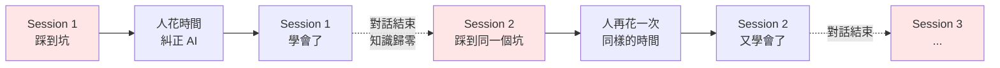
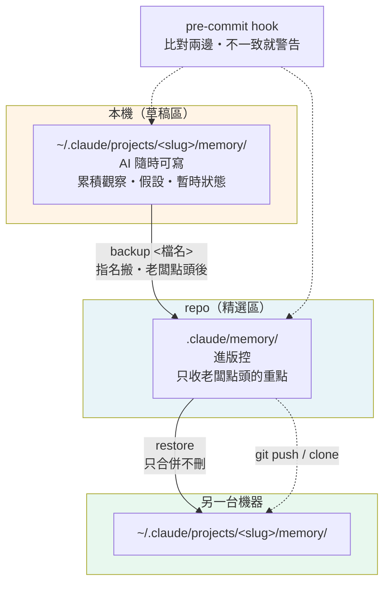
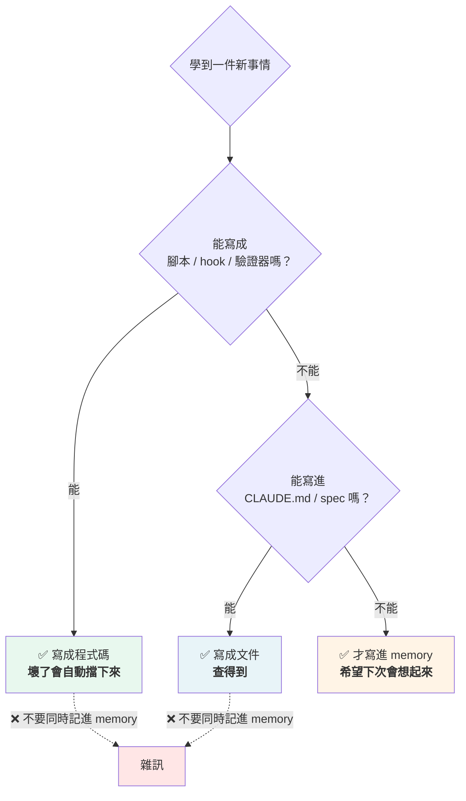
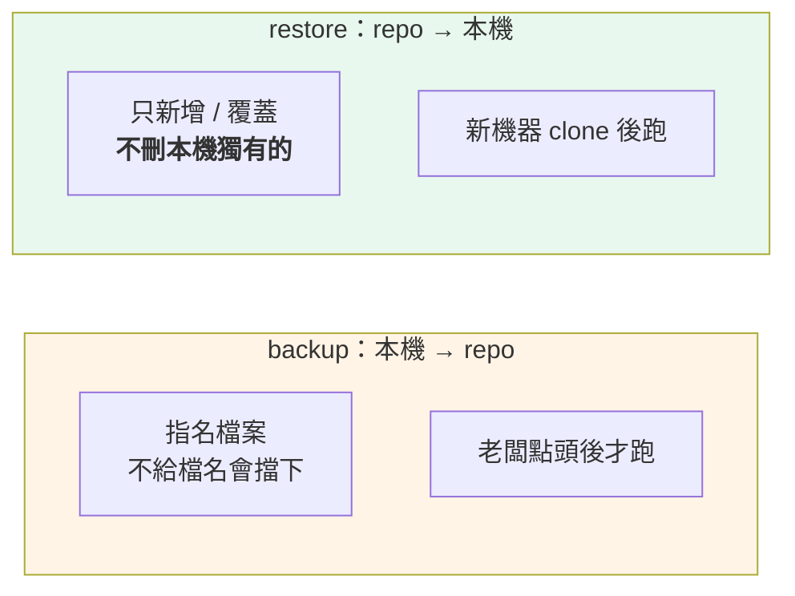

# AI Memory 系統 — 設計理由與復刻指南

> 這份文件講**為什麼**這套 memory 系統長這樣：每個設計要防堵什麼問題、帶來什麼好處、
> 以及怎麼在新專案從零建一套。抽取自一個實戰累積 90+ wave 的真實專案，文中具體案例
> （react-leaflet 那個、27 條 memory 那個）是那個專案的真實情況，當案例參考即可。
>
> 只想知道**怎麼操作**（`backup` / `restore` 指令）的話，看
> [`AI_CEO_WORKING_MODEL.md` §6](AI_CEO_WORKING_MODEL.md) 和 [`README.md`](../README.md)。

---

## 1. 沒有這套會怎樣

AI coding agent 有一個結構性缺陷：**每開一個新對話，它就失憶。**

專案的程式碼它讀得到，但「這個專案踩過哪些坑」讀不到。結果是同一個錯誤反覆發生：



真實例子：這個專案的 `react-leaflet` 對不合法的 event 名稱會**整包 silently 拒收**
——寫了 `keypress` 進 `eventHandlers`，整個物件被忽略，所有 marker 點擊失效，而且不報錯。
第一次查花了好幾小時。沒有 memory 的話，第二次還要再花一次。

**這套系統就是把那幾小時變成下次讀一行就知道。**

---

## 2. 整體架構



**為什麼要分兩個地方，不直接全部進 git？**

因為本機那份會累積大量雜訊——單次 session 的觀察、還在驗證的假設、很快過期的進度。
全部塞進 repo 會有三個後果：

1. partner 讀到一堆雜訊，找不到真正重要的規則
2. 新機器 restore 之後 context 被稀釋
3. repo 的 memory 失去「這些都是硬規則」的權威感

**分開的好處**：本機可以隨便寫，repo 保持精選。兩邊各自做好各自的事。

---

## 3. 一條 memory 的解剖

```markdown
---
name: no-impact-on-partners                          ← ①
description: 改動預設不能影響其他開發 partner…       ← ②
metadata:
  type: feedback                                     ← ③
---

**Rule:** <一句話講清楚規則>                         ← ④

**Why:** <為什麼 —— 哪一次出事、老闆哪句話>          ← ⑤

**How to apply:** <具體怎麼做，可執行的步驟>          ← ⑥

**Related:** [[other-memory-name]]                   ← ⑦
```

| 欄位 | 為什麼需要它 | 沒有會怎樣 |
|---|---|---|
| ① `name` | wikilink 的目標 | 條目之間無法互相引用 |
| ② `description` | **決定這條會不會被讀到** | 見下方說明 |
| ③ `type` | 分類 → 決定保存期限與策展標準 | 過期的專案狀態跟永久規則混在一起 |
| ④ Rule | 一句話能執行的結論 | 讀了半天不知道該做什麼 |
| ⑤ **Why** | **最重要的欄位** | 見下方說明 |
| ⑥ How to apply | 從「知道」到「做得到」 | 規則正確但落不了地 |
| ⑦ Related | 把相關判斷串起來 | 每條孤立，讀到一條看不到全貌 |

### 為什麼 `description` 這麼關鍵

`MEMORY.md` 索引才是每次對話開始時載入的東西，個別 memory 檔是**按需讀取**的。
索引裡每條只有一行 description——**AI 就是靠這一行決定要不要打開來看**。

所以 description 寫得含糊，那條 memory 等於不存在。

❌ `記錄地圖相關的注意事項`
✅ `react-leaflet 對不合法 event 整包 silently 拒收；寫 keypress 會讓所有 marker 點擊失效且不報錯`

第二種寫法，AI 在處理 marker 問題時一眼就知道該打開它。

### 為什麼 Why 是最重要的欄位

**沒有理由的規則會被繞過。** 未來某個 session（或某個 partner）看到一條規則覺得沒道理，
就會改掉或忽略。寫上「Wave 79 那 4 輪 hotfix 互相打架，根本原因就是 agent 沒等畫面穩定」
之後，它就不再是一條任性的規定，而是一次事故的結論。

這也是為什麼 memory 裡要寫具體的 wave 編號、issue 號、日期——**可追溯的規則才守得住**。

---

## 4. 四種 type 各自防堵什麼

| type | 內容 | 防堵什麼 | 保存期限 |
|---|---|---|---|
| `feedback` | 老闆的糾正、翻過車的技術坑、跨 session 的判斷準則 | **同一個錯誤反覆發生** | 長期，直到前提改變 |
| `project` | 業務決策、方向、還沒做的承諾 | **決策反覆討論**、承諾被遺忘 | 中期，**最容易過期** |
| `reference` | 外部資源指標（工具路徑、dashboard、環境細節）| 每次重新找 | 中期，連結會失效 |
| `user` | 使用者是誰、偏好、專業程度 | 溝通方式每次重來 | 長期 |

**`project` 型要特別小心。** 它天生會過期——「Wave 8 之後還有這些待辦」在四個月後
八張單全部 verified，那條 memory 就變成純雜訊。

> **2026-09-11 的實測**：46 條裡有 4 條是過期的 `project` 型，包含一條
> 「等 5:40am Pacific rate limit reset 後繼續」——那是四個月前某一天的事。

**所以新專案建議**：`project` 型的東西優先考慮寫進 `ROADMAP.md` 之類的文件，
而不是 memory。文件人看得到，memory 只有 AI 看得到。

---

## 5. 三層階梯 — 什麼該進 memory

這是整套系統最重要的一條規則，而且**反直覺**：



**判準不是「這件事重不重要」，而是「這件事能不能被更強的機制守住」。**

重要的事很多都**不該**進 memory。程式碼會強制執行，文件查得到，memory 只是
「希望下次會想起來」——最弱的一種。把能自動化的事放進 memory，等於用最不可靠的機制
守最容易守的事，還會稀釋掉真正需要判斷力的條目。

### ⚠️ 「寫進文件」要看是寫進哪一份

這是 2026-09-11 才發現的陷阱：**只有 `CLAUDE.md` 和 memory 會自動載入**，
其他文件都要有人主動打開。

| 寫在哪 | AI 會自動知道嗎 | 適合放什麼 |
|---|---|---|
| 腳本 / hook | ✅ 跑了就會擋 | 可自動驗證的規則 |
| `CLAUDE.md` | ✅ 每次自動載入 | **行為規則** |
| `SUB_AGENT_CHEATSHEET.md` | ⚠️ `CLAUDE.md` 要求必讀 | 操作細節 |
| `docs/` · `README.md` | ❌ 要主動打開 | **背景說明，不是規則** |
| `.claude/memory/` | ✅ 索引自動載入 | 判斷方式 |

> **當時的實例**：`AI_CEO_WORKING_MODEL.md` 有 396 行、是整套模式的說明書，
> 但 `CLAUDE.md` 提到它的次數是 **0**——AI 根本不知道它存在。
> 把規則寫進那裡，等於寫進沒人會打開的抽屜。

---

## 6. 兩個方向的同步



### 三個刻意的設計（別改掉）

**① `backup` 不做全量**

`--all` 存在但預設擋住。策展是**老闆的判斷**，不是腳本的。
一旦能一鍵全量，repo 就會在幾週內被雜訊淹沒。

**② `restore` 不加 `--delete`**

看起來 `rsync --delete` 比較「乾淨」，但那會**刪掉本機所有還沒 submit 的草稿**。
repo 收的是精選，本機是草稿區——用精選去覆蓋草稿區，等於每次 restore 都清空工作中的思考。

**③ `backup` 不放進 setup 腳本**

setup 是「clone 後跑一次」，`backup` 是「持續要跑」。更關鍵的是方向相反：
clone 當下本機 memory 是**空的**，這時跑 backup（本機 → repo）等於拿空目錄覆蓋 repo。

### 防 drift

`pre-commit` hook 每次 commit 比對兩邊，不一致就警告：

```
→ pre-commit: memory drift 偵測
⚠️  本機 memory 跟 repo 不一致：
      feedback_xxx.md project_yyy.md
   要一起 commit 的話先跑：./scripts/sync-memory.sh backup
```

**刻意只警告不自動 staging**——一個修 bug 的 commit 突然夾帶 memory 檔會讓 git history 混亂，
由執行 commit 的人當場決定。

---

## 7. memory 會腐化 — 定期修剪是設計的一部分

**這是最容易被忽略的一環。** memory 寫的當下是對的，但後來會：

- 被程式碼或文件取代（那條規則現在自動執行了）
- 前提改變（當時本機只跑 sqlite，後來 postgres 也是正當選項）
- **直接變成錯的**

### 真實案例：一條會主動害人的 memory

2026-09-11 的盤點抓到 `feedback_team_optimizations` 寫著：

> alice/amy/chris/david **密碼都是 `password`**（不是 alice / demo123456）

但 `SUB_AGENT_CHEATSHEET`（對照 `seed.ts` 並用 bcrypt 實測備份 DB 驗證過）是：

> `alice@example.com` → **`demo123456`**、`admin@triptrust.local` → **`admin123`**

它不只過時，還**用否定句去推翻正確答案**。這種 memory 比沒有更糟——它會覆蓋掉對的資訊。

### 修剪節奏

**每季一次，或文件大幅更新之後**。對每一條問兩個問題：

1. 現在還成立嗎？
2. 已經被程式碼或 `CLAUDE.md` 取代了嗎？

任一個答案是「是」就**刪掉，不要留著以防萬一**。

**一個例外**：被文件或腳本**指名引用**的不刪。例如 `workflow-audit.mjs` 的註解
引用 `feedback_workflow_stages`——那不是重複，是**分層**：文件寫規則，memory 存事件經過。
刪掉會製造死連結，也弄丟來龍去脈。

> 2026-09-11 那次從 46 條刪到 27 條（−41%），其中 4 條過期、12 條已被文件或腳本取代、
> 3 條搬進 `ROADMAP.md`。

---

## 8. 復刻到新專案

### 第一步：建目錄與腳本

```bash
mkdir -p .claude/memory
# 這份範本骨架已經附了 scripts/sync-memory.sh，不依賴任何專案的業務邏輯，
# 直接用即可；若你是從別的地方手動複製，記得 chmod +x
chmod +x scripts/sync-memory.sh
```

`sync-memory.sh` 會自己算出本機路徑：

```bash
SLUG="$(echo "$REPO_ROOT" | sed 's|/|-|g')"
LOCAL_MEM="$HOME/.claude/projects/$SLUG/memory"
```

**這個 slug 是專案絕對路徑把 `/` 換成 `-`。** 換機器、換目錄名，slug 就變了——
這正是為什麼需要 `restore`：檔案進 repo ≠ 自動生效。

### 第二步：建索引

`.claude/memory/MEMORY.md` 一行一條：

```markdown
- [標題（誰在什麼時候說的）](<檔名>.md) — 一句話摘要，要具體到能判斷該不該打開
```

**索引跟實際檔案必須一致。** 檔案在但索引沒列 = restore 後讀不到（等於不存在）；
索引有但檔案不在 = 死連結。定期用這段檢查：

```bash
python3 -c "
import pathlib,re
d=pathlib.Path('.claude/memory')
files={f.stem for f in d.glob('*.md') if f.name!='MEMORY.md'}
idx=set(re.findall(r'\(([a-z0-9_]+)\.md\)',(d/'MEMORY.md').read_text()))
print('檔案但沒索引:',files-idx); print('索引但沒檔案:',idx-files)"
```

### 第三步：接上 pre-commit hook

比對本機與 repo，不一致就警告。**只警告、不自動 staging、不擋 commit。**

### 第四步：把規則寫進 `CLAUDE.md`

至少要有：三層階梯（程式碼 > 文件 > memory）、寫完要問老闆才 submit、定期修剪。
**寫進 `CLAUDE.md` 而不是這份文件**——因為只有前者會自動載入。

### 第五步：寫第一條 memory

不要一次補一堆。**等第一次真的踩坑、被糾正**，當場記下來。
沒有 Why 的 memory 守不住，而 Why 只能來自真實事故。

### 哪些要改成你自己的

| 項目 | 改什麼 |
|---|---|
| `type` 分類 | 四種是這個專案的切法，按你的需求調整 |
| 策展標準 | 誰有權決定進不進 repo |
| 修剪節奏 | 每季 / 每個里程碑 |
| 索引格式 | 只要「一行能判斷要不要打開」就好 |

### 不要改的

| 項目 | 為什麼 |
|---|---|
| `backup` 不做全量 | 一旦能一鍵全量，repo 幾週內被雜訊淹沒 |
| `restore` 不加 `--delete` | 會刪掉本機未 submit 的草稿 |
| 每條都要 Why | 沒有理由的規則會被繞過 |
| 行為規則寫進自動載入的檔 | 寫在別處等於沒寫 |

---

## 9. 目前狀態

| 項目 | 數字 |
|---|---|
| repo 精選 memory | **27 條**（`feedback` 25 · `reference` 2）|
| 最近一次修剪 | 2026-09-11，46 → 27（−41%）|
| 索引 | `.claude/memory/MEMORY.md`，與檔案一致 |

**相關文件**：[`AI_CEO_WORKING_MODEL.md`](AI_CEO_WORKING_MODEL.md)（整套協作模式）·
[`../README.md`](../README.md)（同步指令）· [`../.claude/CLAUDE.md`](../.claude/CLAUDE.md)（行為規則）
